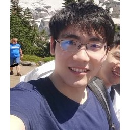
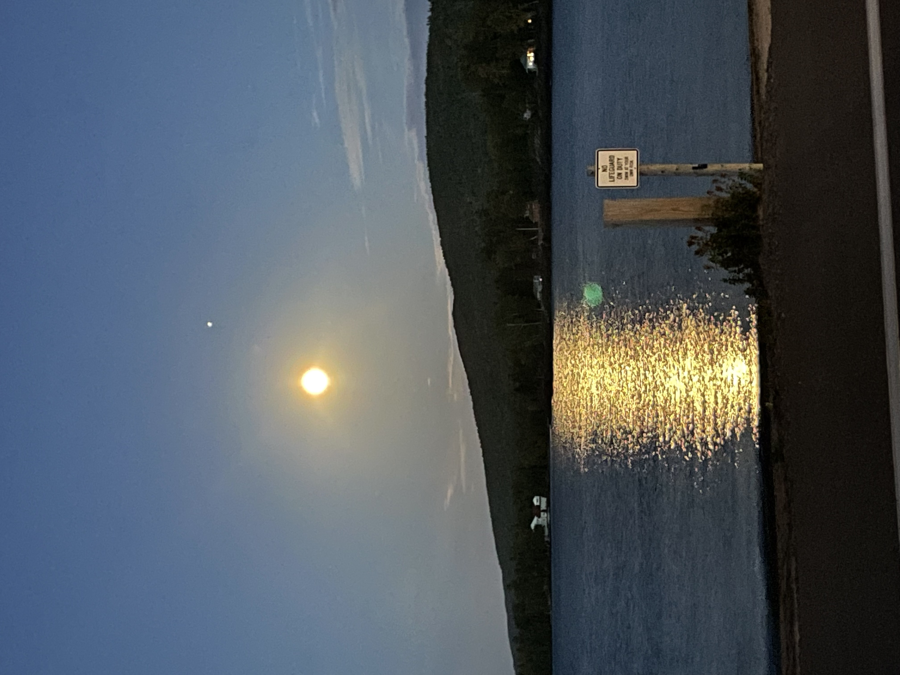
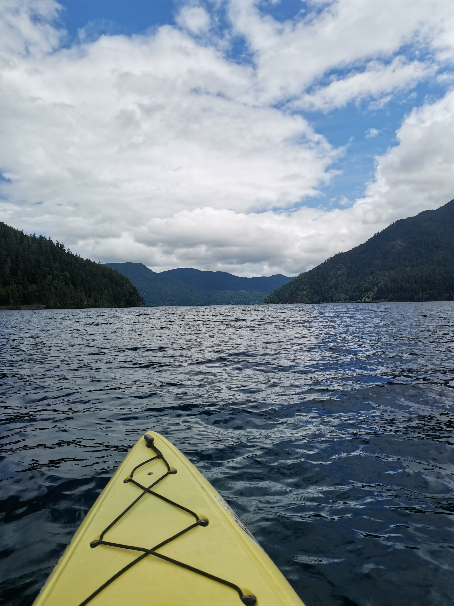
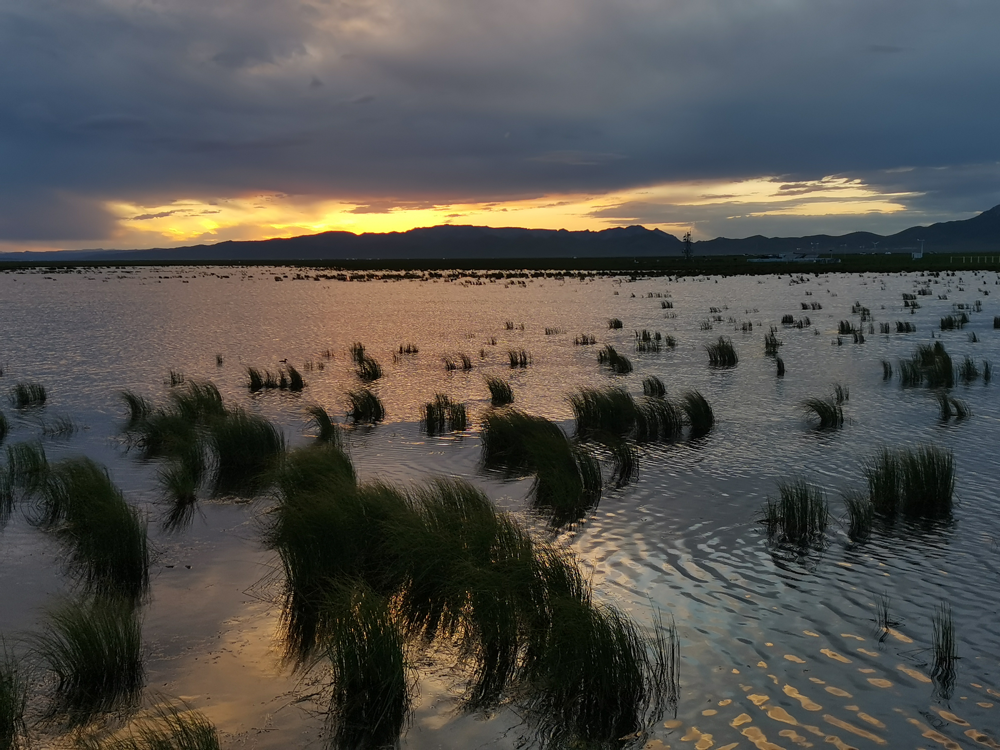
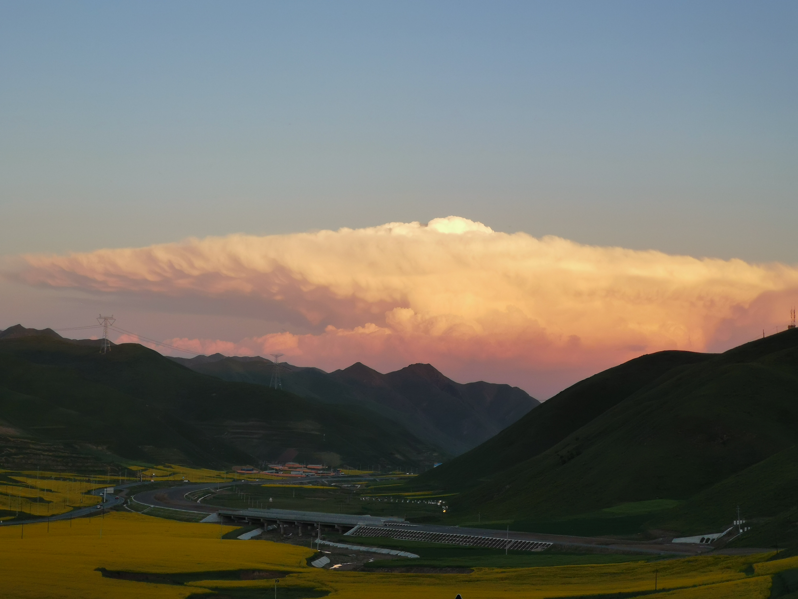
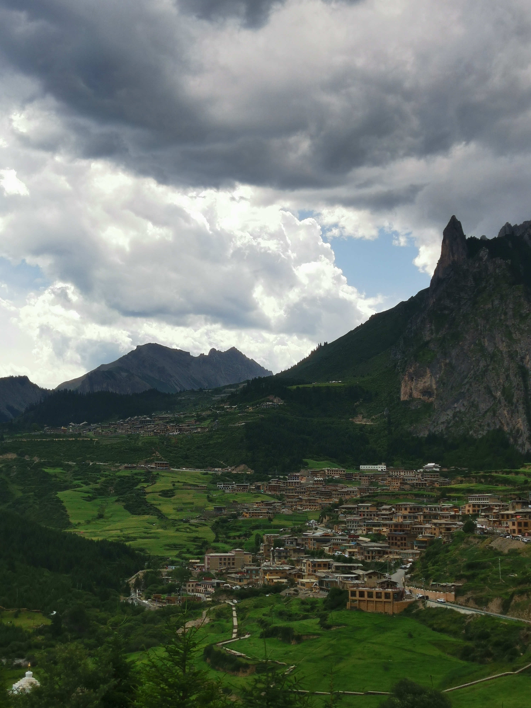

---
# Feel free to add content and custom Front Matter to this file.
# To modify the layout, see https://jekyllrb.com/docs/themes/#overriding-theme-defaults

layout: home
---

<table width="800">
<tr>
<td width="205"> 

</td>
<td width="595" style="text-align:left">

<h1> Zhenggang Tang </h1>
<h4 class="small"> Ph.D. Student </h4>
<h4 class="small"> Department of Computer Science </h4>
<h4 class="small"> University of Illinois Urbana Champaign </h4>
<h4 class="small"> <b>Office:</b> CSL 130, 1308 W Main St, Urbana, IL 61801, United States</h4>
<h4 class="small"> <b>Email:</b> zt15 [at] illinois [dot] edu</h4>

</td>
</tr>
</table>

# Who am I?

Hi there! I am Zhenggang Tang (唐正纲 in Chinese), a third-year Ph.D. candidate in the Department of Computer Science at University of Illinois Urbana-Champaign (UIUC), advised by <a href="https://alexander-schwing.de/" title="Prof. Alex G. Schwing">Prof. Alexander Schwing</a>. 
Prior to that, I get my Bachelor of Science degree in computer science at Peking University with a *Summa Cum Laude*. In my high school years, I learned informatics and got a silver award in the National Olympiad of Informatics (NOI 2016).

My current research interest focus on **topics in 3D vision, from obj/scene reconstruction to transformation and editing**, Previously I also had some research on reinforcement learning(RL) and multi-agent(MA) system. I have conducted or am conducting research in the following fields: 1) NeRF transformation given single RGBD view. 2). RGB-only SDF reconstruction for robotics manipulator control 3) MARL applications on finance and 4) epidemic simulation and 5) reward randomization for RL exploration.

You can check my <a href="tzg_resume.pdf" title="CV">CV</a>, <a href="https://scholar.google.com/citations?user=mGMy_kwAAAAJ" title="gs">Google Scholar</a>, <a href="https://github.com/recordmp3" title="github">Github</a> and <a href="https://www.linkedin.com/in/%E6%AD%A3%E7%BA%B2-%E5%94%90-9a9421201/" title="Linkedin">Linkedin</a> here.

# Publications and Preprints.

**Zhenggang Tang**, Yuchen Fan, Dilin Wang, Hongyu Xu, Rakesh Ranjan, Alex Schwing, Zhicheng Yan, <a href="https://arxiv.org/abs/2412.06974" title="MV-DUSt3R+">"MV-DUSt3R+: Single-Stage Scene Reconstruction from Sparse Views In 2 Seconds"</a>, **CVPR** 2025。[code](https://github.com/facebookresearch/mvdust3r) [website](https://mv-dust3rp.github.io/) [video](https://www.youtube.com/watch?v=LBvnuKQ8Rso&ab_channel=ZGT)

**Zhenggang Tang**, Zhongzheng Ren, Xiaoming Zhao, Bowen Wen, Jonathan Tremblay, Stan Birchfield, Alexander Schwing, "NeRFDeformer: NeRF Transformation from a Single View via 3D Scene Flows", **CVPR** 2024.

Yuchen Fang\*, **Zhenggang Tang\***, Kan Ren, Weiqing Liu, Li Zhao, Jiang Bian, Dongsheng Li, Weinan Zhang, Yong Yu, Tie-Yan Liu, <a href="https://arxiv.org/abs/2307.03119" title="MARL on multi-order execution">""Learning Multi-Agent Intention-Aware Communication for Optimal Multi-Order Execution in Finance"</a>,  ACM **SIGKDD** Conference on Knowledge Discovery and Data Mining, 2023. (\*contribute equally).

**Zhenggang Tang**, Balakumar Sundaralingam, Jonathan Tremblay, Bowen Wen, Ye Yuan, Stephen Tyree, Charles Loop, Alexander Schwing, Stan Birchfield. <a href="https://arxiv.org/pdf/2210.11668.pdf" title="SDF reconstruction">"RGB-Only Reconstruction of Tabletop Scenes for Collision-Free Manipulator Control"</a>, Arxiv 2210.11668, IEEE International Conference on Robotics and Automation (**ICRA**), 2023.

**Zhenggang Tang\***, Chao Yu\*, Boyuan Chen, Huazhe Xu, Xiaolong Wang, Fei Fang, Simon Shaolei Du, Yu Wang, Yi Wu, <a href="https://openreview.net/forum?id=lvRTC669EY_" title="reward randomlization">"Discovering Diverse Multi-Agent Strategic Behavior via Reward Randomization"</a>, International Conference on Learning Representations (**ICLR**), 2021 (*contribute equally)

**Zhenggang Tang\***, Kai Yan\*, Liting Sun, Wei Zhan, Changliu Liu. <a href="https://arxiv.org/abs/2108.06589" title="MARL">A Microscopic Pandemic Simulator for Pandemic Prediction Using Scalable Million-Agent Reinforcement Learning.</a>, **Arxiv** 2108.06589. (\*contribute equally)

# Working Experiences

**Meta** from May. 2024.

**NVIDIA** mentored by <a href="https://scholar.google.com/citations?user=_bKTUqAAAAAJ&hl=zh-CN" title="Stan">Dr. Stan Birchfield</a> from May. 2022 to Sept. 2022.

**Microsoft Research Asia** mentored by <a href="https://www.saying.ren/" title="Kan Ren">Dr. Kan Ren</a> and <a href="https://www.microsoft.com/en-us/research/people/weiqiliu/" title="Weiqing Liu">Dr. Weiqing Liu</a> from Dec. 2020 to May. 2021, and was awarded *Stars of Tomorrow*.

**Institute for Interdisciplinary Information Sciences, Tsinghua University** mentored by <a href="https://jxwuyi.weebly.com/" title="Yi Wu">Prof. Yi Wu</a> from Nov. 2019 to May. 2020.

# Random photos of travel

	
Mt. Rainier, WA

	
	
	
	
	

	
Michigan Upper Peninsula, MI

	
	
	

	
Olympic National Park, WA

	
	
	
	

	
Ngawa, Sichuan

	
	<text>galaxy credits to **Ruxu Geng**</text>
	
	
	
	

